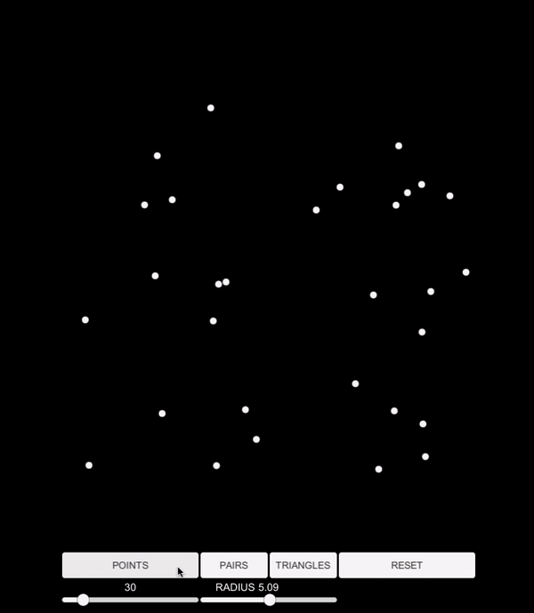

# Topological Data Analysis 01

Creation of <a href="https://en.wikipedia.org/wiki/Vietoris%E2%80%93Rips_complex">Vietoris-Rips-complex(es)</a> from random data points.

<a href="https://drk4oz.itch.io/topological-data-analysis-01">Try it here</a>

1. Set slider to decide the number of random data points to generate.
2. Decide radius of each point.
3. Press buttons to generate points, pairs, or triangles.

Developed using <a href="https://store.unity.com/download?ref=personal">Unity</a>.
